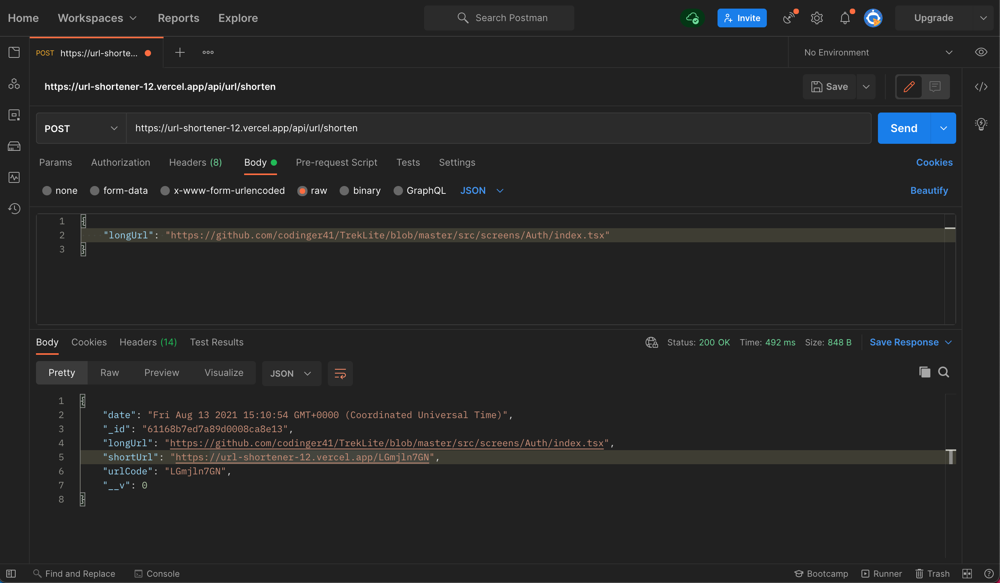

# URL Shortener:

URL shortening service built with NodeJS, Express and Mongo DB.

## Overview

This is a backend web application that allows users to convert long URLs to more accessible and maintainable short URLs.

Utilized Express framework, Mongo DB, and [shortid](https://www.npmjs.com/package/shortid), a package which generates short non-sequential unique ids for the shortening service.

## Live Demo

Deployed the live version of the app here: [here](https://url-shortener-12.vercel.app/api/url/shorten)

- Postman Testing
  

```

## Getting Started

1. Clone the repo

```

$ git clone https://github.com/AbdussamadYisau/Url-Shortener-API
$ cd Url-Shortener-API

```

2. Install the dependencies:

```

$ npm install

```

3. Run the development server:

```

$ node index.js

```

4. Navigate to [http://localhost:8080/api/url/shortener](http://localhost:8080/api/url/shortener)

```
